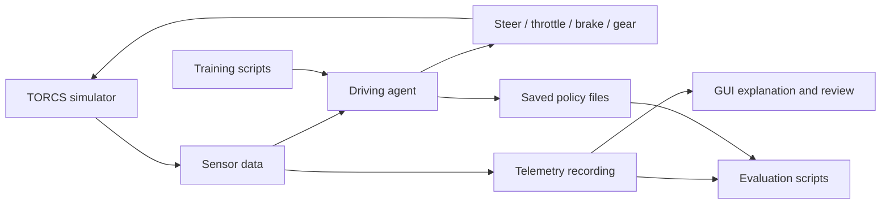
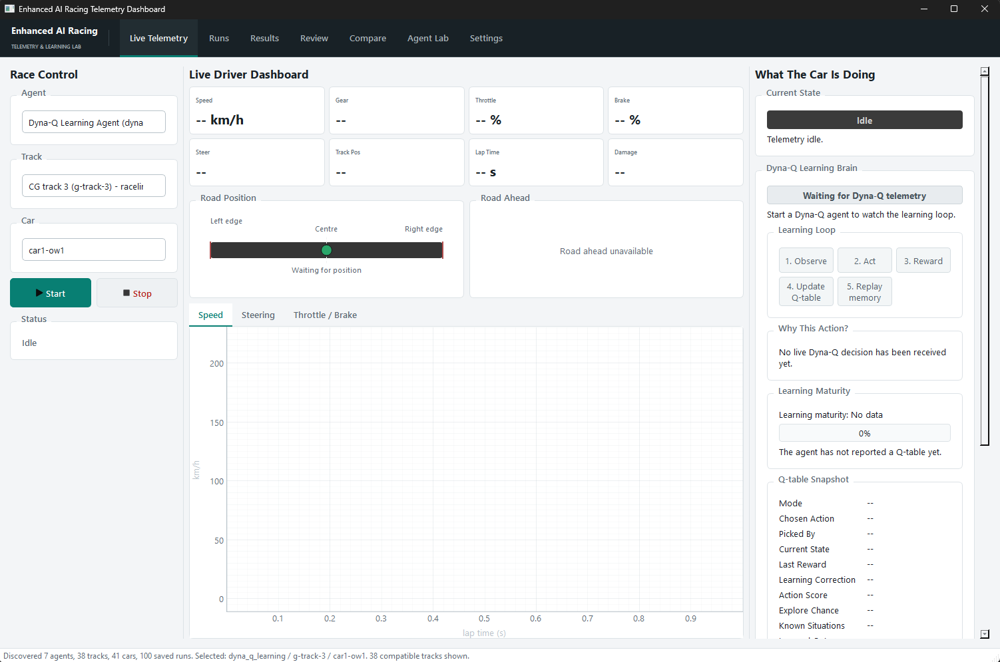
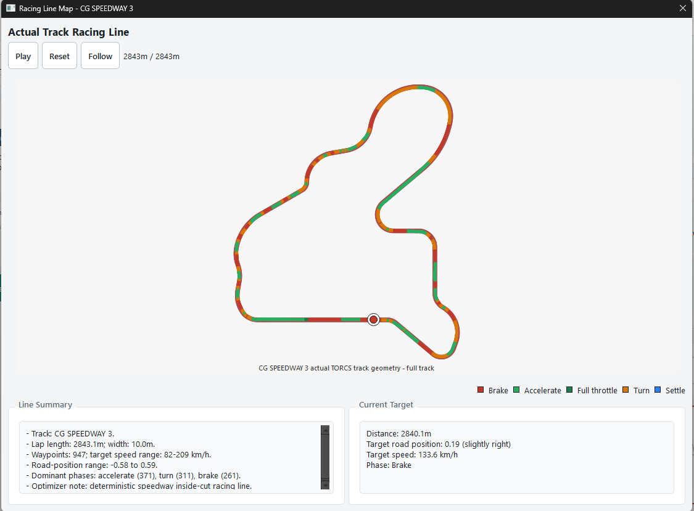
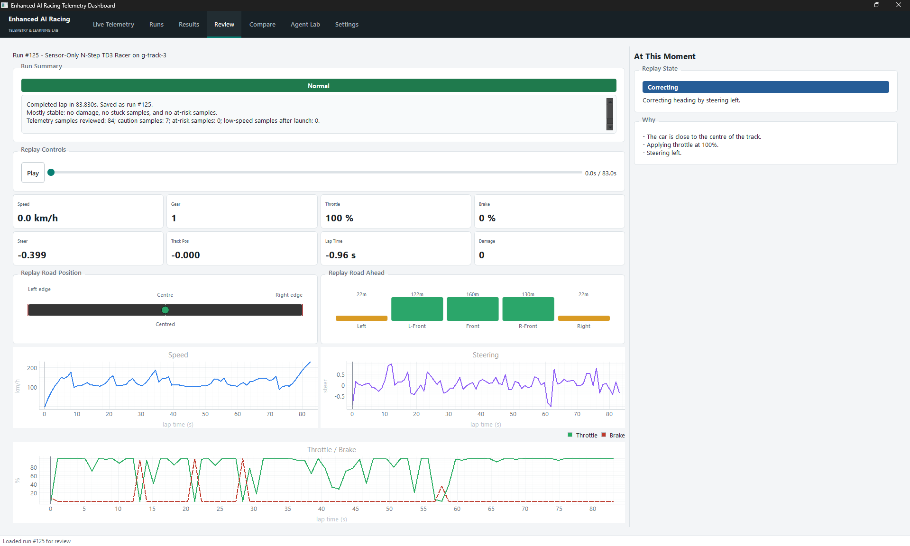

# MAT099 Enhanced AI Racing

**An AI racing research and learning platform for creating, testing, comparing, and explaining autonomous driving agents in TORCS.**

MAT099 Enhanced AI Racing is my dissertation project. It combines autonomous
racing agent development with an educational interface for understanding how AI
agents behave.

The project allows different types of driving agents to be created, tested, and
compared in TORCS, including rule-based agents, racing-line agents, and
reinforcement learning agents. Alongside the agent development work, the project
presents telemetry, race behaviour, and evaluation results in a way that helps
people who are new to AI understand what the agent is doing and why.

The aim is not only to make a car drive around a track. The aim is to research
different approaches to AI control and present them clearly enough that the
process can be inspected, explained, and learned from.

## Quick Start

There are two supported ways to use the project:

| You want to... | Use this route |
| --- | --- |
| Run the finished desktop application | Download a release ZIP when one is published, extract the complete `Enhanced AI Racing` folder, then open `EnhancedAIRacing.exe`. |
| Work with the source code, train agents, or change the GUI | Clone the repository, create the Python environment, and run the source application. |
| Build your own Windows application folder | Run the reproducible PowerShell build command below. |

The generated executable and its `_internal` folder are intentionally excluded
from Git. They are release artefacts, not source code. 

## Project Aim

This project has two connected goals:

1. **Agent development and research**

   Build autonomous driving agents that can control a car in TORCS, then compare
   how different AI approaches perform around a track.

2. **AI learning and explanation**

   Present agent behaviour through a GUI, telemetry, explanations, and comparison
   tools so that readers who are unfamiliar with AI can understand the main
   concepts behind autonomous decision-making.

In simple terms, the project asks:

```text
How can autonomous racing agents be built, tested, compared, and explained in a
way that supports both dissertation research and AI learning?
```

## Research Focus

The dissertation investigates how different agent strategies can be used for
autonomous racing.

The current project focuses on:

- **Rule-based control**  
  Agents that use hand-written driving rules, such as steering correction,
  speed control, braking rules, and anti-spin behaviour.

- **Map-aware and racing-line control**  
  Agents that use track information and a planned racing line to make more
  informed driving decisions.

- **Reinforcement learning**  
  A Dyna-Q learning agent that learns from repeated interaction with TORCS and
  saves a policy for later evaluation.

- **Deep reinforcement learning**
  Agent 7 and Agent 8 use N-step TD3 with neural actor-critic policies. Agent
  7 receives racing-line geometry as context; Agent 8 learns from car and road
  sensors without a racing line or teacher actions.

The project compares these approaches using measurable race outputs such as
progress, lap completion, speed, off-track events, crashes, rewards, and
telemetry patterns.

## Educational Focus

A second purpose of the project is to make AI behaviour easier to understand.
Instead of only showing final scores, the project records and displays the
decision-making process behind a race.

The educational side of the project is designed to help learners understand:

- what an AI agent is
- how an agent receives information from an environment
- how sensor data becomes an action
- how rule-based logic differs from learning-based logic
- what reinforcement learning means in a practical racing example
- how rewards influence future decisions
- why telemetry is useful for explaining agent behaviour
- how trained policies can be evaluated after learning

The racing environment makes these ideas easier to see because decisions have
visible consequences: the car can stay on track, take a corner well, spin,
crash, slow down, recover, or complete a lap.

## How The System Works

At a high level, the project follows an agent-environment loop:

1. TORCS runs the racing simulation.
2. Python receives live sensor data from the car.
3. A selected agent analyses the current situation.
4. The agent chooses steering, throttle, braking, and gear actions.
5. TORCS applies the action and updates the simulation.
6. The project records telemetry and race results.
7. The GUI and scripts allow the results to be reviewed and compared.



This loop is the core AI idea behind the project: the agent observes the
environment, acts, receives feedback, and can be evaluated or improved.

## Agents Included

| Agent | Purpose |
| --- | --- |
| Random Agent | A simple baseline that demonstrates uncontrolled or weak decision-making. |
| Rule-Based Anti-Spin Agent | Uses hand-written rules to stabilise the car and reduce poor driving behaviour. |
| Map-Aware Racing-Line Agent | Uses track and racing-line information to guide the car around the circuit. |
| Dyna-Q Learning Agent | Learns from experience using reinforcement learning and saves a policy. |
| Dyna-Q Finalised Agent | Loads a trained policy and drives without further learning or exploration. |
| torcsRL N-Step TD3 Racer (Agent 7) | Learns continuous control with a racing-line preview used as context, not as copied actions. |
| Sensor-Only N-Step TD3 Racer (Agent 8) | A reward-only neural policy that learns from vehicle telemetry and 19 road sensors. |

These agents allow the project to show a progression from simple behaviour to
more structured and learning-based decision-making.

## Current Deep RL Evidence

- **Agent 7** is the racing-line-informed N-step TD3 comparison. The racing
  line provides geometric context, but never teacher steering, throttle, or
  braking actions.
- **Agent 8** is the sensor-only N-step TD3 comparison. It receives vehicle
  telemetry, 19 road sensors, and short-term driving history, with no racing
  line or external demonstration.
- The packaged app includes protected runtime policies for both agents. Agent
  8 uses the verified `champion_83_038s_36of40_clean.pt` checkpoint used by the
  final application validation runs.

Training logs, checkpoints, replay buffers, and detailed evaluation outputs are
kept locally under `models/` and `data/`. They are excluded from the source
repository so the codebase stays practical to clone; the GUI Results and
Settings evidence views explain how the preserved results should be read.

## What The Interface Helps Explain

The GUI is not only a control panel. It is also part of the educational design
of the project.

It is used to:

- select and run different agents
- view live telemetry while the agent drives
- review saved race runs
- compare different agents or runs
- inspect racing-line behaviour
- show explanations for agent decisions and state
- make the learning process easier to follow visually

This is important because AI systems can be difficult to understand if only the
code or final score is shown. The interface helps connect the technical logic to
observable behaviour.

## Application Views

The desktop application is designed as both a telemetry tool and an introduction
to autonomous-agent behaviour. These screenshots show the final interface using
real project data rather than mockups.

### Live Telemetry



### Racing-Line Inspection



### Saved Agent 8 Run Review



## Key Concepts

| Concept | Meaning in this project |
| --- | --- |
| Agent | The Python driver that decides how the car should move. |
| Environment | The TORCS racing simulator. |
| Sensor data | Information received from TORCS, such as speed, angle, track position, and road sensors. |
| Action | A control decision sent back to TORCS, such as steering or braking. |
| Telemetry | Recorded data that shows what happened during the race. |
| Reward | A score used by a learning agent to judge whether behaviour was useful. |
| Policy | Saved decision-making knowledge, such as a Dyna-Q table or a neural TD3 checkpoint. |
| Training | Repeated runs where a learning agent updates its policy. |
| Evaluation | Testing an agent or saved policy and measuring the result. |
| Racing line | A planned route around the track used to guide driving decisions. |

## Repository Structure

| Path | What it contains |
| --- | --- |
| `src/agents/` | Driving agents and decision-making logic. |
| `src/gui/` | Desktop application for running, reviewing, comparing, and explaining races. |
| `src/runner/` | TORCS launch, connection, lap tracking, and race execution code. |
| `src/racing_line/` | Track map parsing, racing-line generation, and control helpers. |
| `src/storage/` | SQLite storage for race results, metrics, and telemetry. |
| `scripts/` | Training, evaluation, plotting, and replay utilities. |
| `tests/` | Automated tests for the main project components. |
| `data/policies/` | Saved Dyna-Q policy files. |
| `data/racing_lines/` | Saved racing-line files and related outputs. |
| `data/generated/` | Local generated data, including race databases and telemetry files. |
| `data/evaluation/` | Evaluation outputs from policy testing. |
| `torcs/` | Local Windows TORCS simulator files used by the project. |
| `torcs-wrapper/gym_torcs/` | Python wrapper used to communicate with TORCS. |

## Documentation

The documentation is deliberately split by purpose rather than duplicated in a
single handbook. Start with [`docs/README.md`](docs/README.md) for the reading
path, then use the Agent 7/8, GUI evidence, and packaging notes as needed.

## Running The Project

The project is developed for Windows with Python 3.12.

### Source Development

Clone the repository, then create and activate the development environment:

```powershell
git clone https://github.com/natebassett/mat099-enhanced-ai-racing.git
cd mat099-enhanced-ai-racing
python -m venv torcs-env
.\torcs-env\Scripts\Activate.ps1
```

Install the main Python packages:

```powershell
python -m pip install --upgrade pip
python -m pip install -r requirements.txt
```

Launch the desktop application:

```powershell
python src\gui\app.py
```

The GUI starts TORCS automatically when a race begins. The console menu remains
available for direct agent runs:

```powershell
python src\main.py
```

Run the automated test suite:

```powershell
python -m unittest discover -s tests
```

### Build The Windows Application

Install the build-only dependency, then build a self-contained application
folder containing the executable, its required runtime files, TORCS, and the
final Agent 7/8 policies:

```powershell
.\torcs-env\Scripts\python.exe -m pip install -r packaging\windows\requirements-build.txt
.\scripts\build_windows_app.ps1
```

The result is:

```text
dist\Enhanced AI Racing\EnhancedAIRacing.exe
```

Keep `_internal` beside the executable. The application will not run if only
the `.exe` is copied. See [the packaging guide](docs/windows-packaging.md) for
the release smoke test and GitHub Release checklist.

## Main Commands

Train the Dyna-Q learning agent:

```powershell
python scripts\train_dyna_q_policy.py --episodes 5
```

Evaluate a saved Dyna-Q policy:

```powershell
python scripts\evaluate_dyna_q_policy.py --policy-path data\policies\dyna_q_g_track_3_best.json
```

Generate a racing line for the default track:

```powershell
python scripts\generate_racing_line.py torcs\tracks\road\g-track-3\g-track-3.xml data\racing_lines\g-track-3.json --measured-length 2843.0934
```

Replay map-aware telemetry without moving TORCS:

```powershell
python scripts\replay_map_aware_telemetry.py --input data\generated\map_aware_telemetry.csv --output data\generated\map_aware_replay_eval.csv
```

Plot racing-line tracking from recorded telemetry:

```powershell
python scripts\plot_raceline_tracking.py --input data\generated\map_aware_telemetry.csv --output data\generated\map_aware_tracking.svg
```

## Recommended Learning Path

For someone new to AI, the project is easiest to understand in this order:

1. Run the GUI.
2. Watch the Random Agent to see a weak baseline.
3. Run the Rule-Based Agent and compare the improvement.
4. Review telemetry to connect behaviour with data.
5. Run the Map-Aware Agent to see how track knowledge changes behaviour.
6. Watch the Dyna-Q Learning Agent, then compare it with the stable Dyna-Q
   Finalised Agent.
7. Run Agent 7 to see neural control with track geometry as context.
8. Run Agent 8 to see reward-only sensor-based neural control.
9. Use Results, Review, Compare, and Agent Lab to distinguish a fast lap from
   a reliable policy.

This path moves from visible behaviour to the underlying AI concepts.

## TORCS Notes

TORCS must be available at:

```text
torcs\wtorcs.exe
```

The Python runner attempts to start TORCS and open a Practice race
automatically. If that does not happen, TORCS can be started manually from the
simulator menu while the Python runner waits.

The default TORCS communication port is:

```text
3001
```

## Outputs And Results

| Output | Location |
| --- | --- |
| Race database | `data/generated/race_results.db` |
| Dyna-Q policies | `data/policies/` |
| Agent 7/8 runtime checkpoints | `models/agent7_n_step_td3_v3/` and `models/agent8_sensor_n_step_td3_self_imitation_stability/` |
| Agent 7/8 training logs | `models/training_runs/` |
| Evaluation outputs | `data/evaluation/` |
| Generated telemetry | `data/generated/` |
| Racing lines | `data/racing_lines/` |

Generated files should be reviewed before committing because some are durable
experiment artefacts and others are temporary local outputs.

## Troubleshooting

If TORCS does not open, check that `torcs\wtorcs.exe` exists and that the
project is being run on Windows.

If the race does not start automatically, open TORCS and start a Practice race
manually.

If Python imports fail, check that the virtual environment is active and that
the required packages are installed.

If the GUI shows no run history, run at least one race or check whether
`data\generated\race_results.db` exists.

If training or evaluation appears slow, remember that TORCS is running a live
simulation and the agent is making decisions step by step.

## Dissertation Context

This repository supports my MAT099 dissertation. It is not intended to be a
general-purpose racing simulator package. It is a research and learning
environment for developing autonomous racing agents and presenting their
behaviour in a way that can be understood by readers with different levels of AI
experience.

The project is designed to make the relationship between simulation, agent
logic, reinforcement learning, telemetry, evaluation, and explanation easier to
see.
