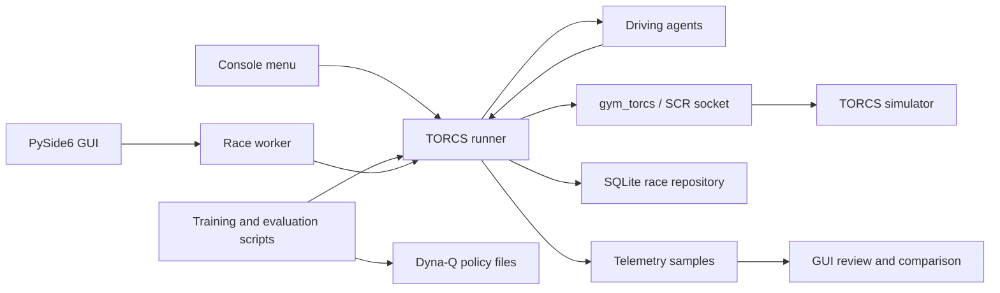

# MAT099 Enhanced AI Racing

**Status:** Dissertation research codebase  
**Primary platform:** Windows desktop  
**Simulator:** TORCS, integrated through a local `gym_torcs` wrapper

MAT099 Enhanced AI Racing is a Python-based research project that connects AI
driving agents to TORCS, records race telemetry, and provides tooling for
training, evaluating, and reviewing autonomous racing behaviour.

The repository is maintained as a solo dissertation project, but it is organised
like a small research software codebase: the implementation, experiment scripts,
tests, generated artefact locations, and simulator integration are kept in one
place so that the work can be inspected and reproduced.

## Overview

The project investigates how different agent strategies perform in a simulated
racing environment. It includes simple baseline agents, rule-based control,
map-aware racing-line control, and a Dyna-Q learning agent trained on TORCS
telemetry.

The application supports two main modes of use:

- A desktop GUI for selecting agents, running races, reviewing telemetry, and
  comparing saved runs.
- Command-line scripts for training Dyna-Q policies, evaluating saved policies,
  generating racing lines, and replaying telemetry offline.

## Key Features

- TORCS launch and SCR socket integration from Python.
- PySide6 desktop dashboard for live runs, run history, telemetry review, agent
  explanation, and racing-line visualisation.
- Multiple driving agents:
  - random baseline agent
  - rule-based anti-spin agent
  - map-aware racing-line agent
  - Dyna-Q learning agent
  - finalised Dyna-Q evaluation agent
- SQLite-backed storage for race summaries, metrics, and telemetry samples.
- Training and evaluation workflows for saved Dyna-Q policies.
- Racing-line generation and offline telemetry replay tools.
- Unit tests covering agents, telemetry models, storage, runner startup logic,
  map-aware tools, and training/evaluation helpers.

## System Architecture



## Repository Structure

| Path | Purpose |
| --- | --- |
| `src/agents/` | Driving agents and policy logic. |
| `src/gui/` | PySide6 desktop application, telemetry views, comparison tools, and project discovery. |
| `src/runner/` | TORCS process control, SCR connection handling, lap tracking, and race execution. |
| `src/racing_line/` | Track map parsing, racing-line optimisation, and control helpers. |
| `src/storage/` | SQLite repository and database migrations for race results and telemetry. |
| `scripts/` | Training, evaluation, racing-line generation, and telemetry replay utilities. |
| `tests/` | Unit tests for core project behaviour. |
| `data/policies/` | Saved Dyna-Q policy checkpoints. |
| `data/racing_lines/` | Saved racing-line definitions and reference visual output. |
| `data/generated/` | Runtime-generated database and telemetry files. |
| `data/evaluation/` | Evaluation outputs produced by policy evaluation scripts. |
| `torcs/` | Local Windows TORCS installation used by the project. |
| `torcs-wrapper/gym_torcs/` | Local TORCS gym/SCR wrapper used by the runner. |

## Requirements

The project is developed against Python 3.12 on Windows. Real TORCS runs require
the bundled Windows executable at:

```text
torcs\wtorcs.exe
```

Core Python packages used by the current codebase are:

- `numpy`
- `gym`
- `PySide6`
- `pyqtgraph`

The dependency manifest is part of the repository cleanup work. Until it is
added, install the required packages manually in a virtual environment.

## Setup

Run these commands from the repository root:

```powershell
python -m venv .venv
.\.venv\Scripts\Activate.ps1
python -m pip install --upgrade pip
python -m pip install numpy gym PySide6 pyqtgraph
```

If PowerShell blocks virtual environment activation, allow scripts for the
current shell session:

```powershell
Set-ExecutionPolicy -ExecutionPolicy Bypass -Scope Process
.\.venv\Scripts\Activate.ps1
```

## Quick Start

Launch the desktop application:

```powershell
python src\gui\app.py
```

Launch the console menu:

```powershell
python src\main.py
```

Run the test suite:

```powershell
python -m unittest discover -s tests
```

## Common Workflows

Train the Dyna-Q policy for the default `g-track-3` setup:

```powershell
python scripts\train_dyna_q_policy.py --episodes 5
```

Evaluate the best saved Dyna-Q policy without further learning:

```powershell
python scripts\evaluate_dyna_q_policy.py --policy-path data\policies\dyna_q_g_track_3_best.json
```

Generate a racing line for `g-track-3`:

```powershell
python scripts\generate_racing_line.py torcs\tracks\road\g-track-3\g-track-3.xml data\racing_lines\g-track-3.json --measured-length 2843.0934
```

Replay map-aware telemetry through the current controller logic:

```powershell
python scripts\replay_map_aware_telemetry.py --input data\generated\map_aware_telemetry.csv --output data\generated\map_aware_replay_eval.csv
```

Plot map-aware racing-line tracking from recorded telemetry:

```powershell
python scripts\plot_raceline_tracking.py --input data\generated\map_aware_telemetry.csv --output data\generated\map_aware_tracking.svg
```

## TORCS Notes

The runner starts the bundled Windows TORCS executable and attempts to advance
the simulator into Practice mode automatically. If automatic startup does not
open the SCR socket, TORCS remains open and the runner waits while Practice mode
is started manually.

The default SCR UDP port used by the project is `3001`.

## Data and Outputs

Race runs are stored in SQLite when the application records results:

```text
data\generated\race_results.db
```

Dyna-Q policy checkpoints are stored under:

```text
data\policies\
```

Evaluation telemetry is written under:

```text
data\evaluation\
```

Map-aware telemetry and replay outputs are written under:

```text
data\generated\
```

Generated data should be reviewed before committing. The repository cleanup
branch will separate durable dissertation artefacts from local run outputs.

## Testing

The tests are written with Python's standard `unittest` framework:

```powershell
python -m unittest discover -s tests
```

Some tests exercise offline models and helper functions only. Full live race
validation still requires a Windows desktop session with TORCS available.

## Project Handbook

This README is the short project entry point. The next documentation artefact
for the cleanup branch is a dissertation-oriented handbook under `docs/`, with:

- installation notes
- all repeatable commands
- troubleshooting guidance
- experiment and evaluation notes
- glossary of project terms
- reproducibility checklist

## Troubleshooting

If TORCS does not start, confirm that `torcs\wtorcs.exe` exists and that the
project is being run on Windows.

If the race does not begin automatically, use the TORCS menu to start a Practice
race while the runner is waiting.

If imports fail, confirm that the virtual environment is active and that the
packages listed in `Requirements` are installed.

If run history is empty in the GUI, run at least one race or check whether
`data\generated\race_results.db` or `latest_race_runs.csv` exists.

## Dissertation Context

This repository supports the MAT099 dissertation project. Its goal is not to be
a general-purpose racing simulator package; its purpose is to make the research
implementation, experimental workflow, and evaluation artefacts clear enough to
review, reproduce, and extend.
